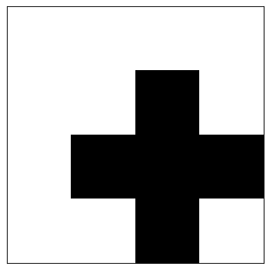
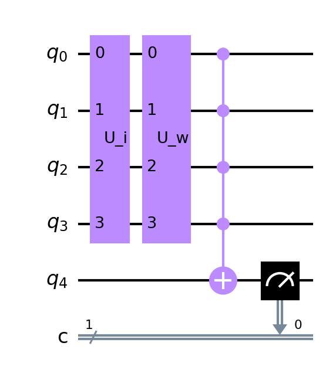

# Quantum Perceptron

[](#python) [](#price) [](#maintained)

**Implementation of Quantum Perceptron: An Artificial Neuron Implemented on an Actual Quantum Processor.**

This project implements McCullogh-Pitts Perceptron as described in [An Artificial Neuron Implemented on an Actual Quantum Processor](https://arxiv.org/abs/1811.02266) on IBM's [Qiskit](https://qiskit.org/) quantum simulator.  

The repository contains the extensive codebase to create quantum perceptron circuit based on specific weight and input data. Moreover, we created training data as shown in the paper (checkboard patterns for different numbers) and simulated the training using single perceptron to update the weight. You can have a look at perceptron training in [`TrainPerceptron.ipynb`](./TrainPerceptron.ipynb). We have used training details from [this article on nature](https://www.nature.com/articles/s41534-019-0140-4) by the authors of the original paper.

Moreover, the authors of the paper evaluates single perceptron for different weight-input pairs and generate visualization. They prove that the probability (output of perceptron) is 1 when `weight = input`. We have simulated the same thing and created visualization in [`PerceptronSimulator.ipynb`](./PerceptronSimulator.ipynb).

We have included the [project presentation](./details/presentation.pdf) and [project report](./details/report.pdf) in `details` directory which provides smaller details about the project and the implementation details.


## Usage

We have created the codebase such that the perceptron circuit can be utilized directly for any other usage. The code is scalable and takes the most possibilities into account. Note that we are deliberately raising error in case the perceptron with more than 9 qubits is initialized.

To use the perceptron, you will need to clone this repository and add the repository directory to `$PATH`:

```bash
git clone https://github.com/ashutosh1919/quantum-perceptron.git
export PATH=./quantum_perceptron:$PATH
```

Now, you can use the perceptron codebase in your own project. To get started with experimenting on quantum perceptron, you can use below starter code:

```python
from quantum_perceptron import Perceptron
from quantum_perceptron.utils import (
    calculate_succ_probability,
    plot_img_from_data
)

# Define perceptron initial parameter
num_qubits = 4
input_data = 12
weight_data = 626

# You can visualize input/weight data in checkboard pattern
plot_img_from_data(
    data=weight,
    num_qubits=num_qubits
)

# Intialize perceptron object
perceptron = Perceptron(
    num_qubits=num_qubits,
    weight=weight_data,
    input=input
)

# Generate measurement outcomes for 3000 number of iterations
counts = perceptron.measure_circuit(
    num_iters=3000
)

# Find the success probability (Number of 1s)/(Total iterations)
prob = calculate_succ_probability(counts)

# Draw circuit
perceptron.save_circuit_image(
    file_path='qubit_4_circ.png',
    output_format="mpl"
)
```

The checkboard pattern image generated by the above code will look something like this:  



The saved image for the perceptron circuit of 4 qubits looks something like this:  



In the above circuit, we can see two components `U_i` and `U_w`. These components are specifically to process input and weight data values respectively. The circuit is different for different values of input and weight. For more information, please take a look at the descriptions in the paper. For implementation, you can take a look at [`perceptron.py`](./quantum_perceptron/perceptron.py).


## Reference

An Artificial Neuron Implemented on an Actual Quantum Processor -- https://arxiv.org/abs/1811.02266

```
@article{Tacchino_2019,
	doi = {10.1038/s41534-019-0140-4},
	url = {https://doi.org/10.1038%2Fs41534-019-0140-4},
	year = 2019,
	month = {mar},
	publisher = {Springer Science and Business Media {LLC}},
	volume = {5},
	number = {1},
	author = {Francesco Tacchino and Chiara Macchiavello and Dario Gerace and Daniele Bajoni},
	title = {An artificial neuron implemented on an actual quantum processor},
	journal = {npj Quantum Information}
}
```

## License

See the [LICENSE](LICENSE) file.